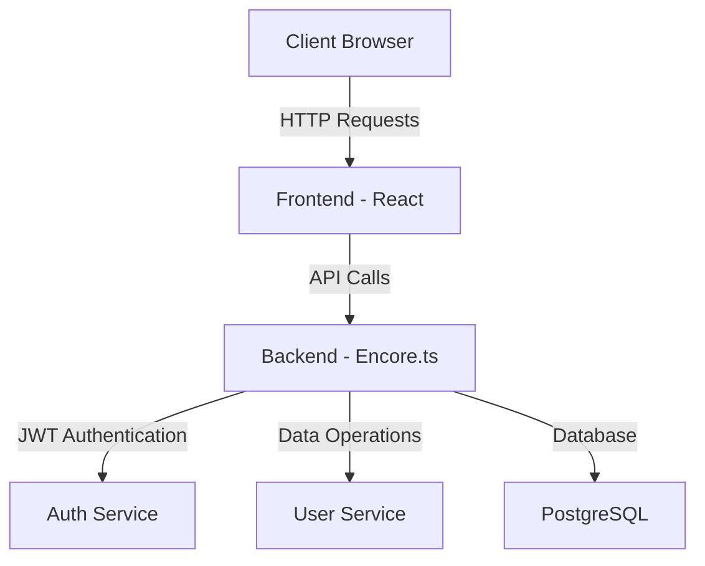
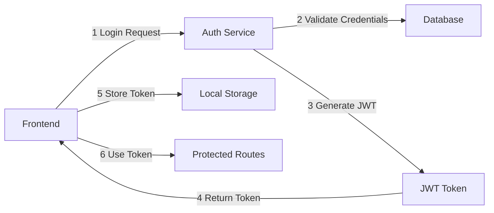
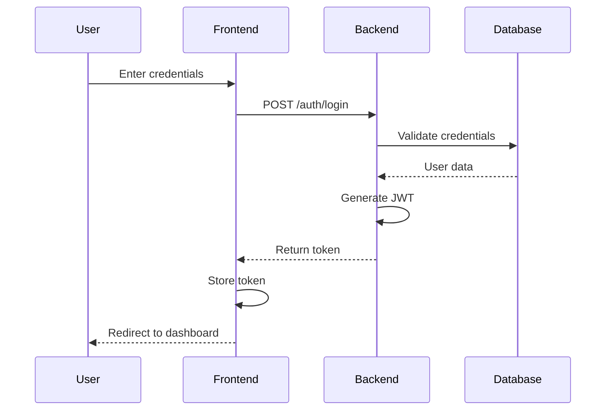

# Encore Auth Project Documentation

## Table of Contents
1. [Project Overview](#project-overview)
2. [Architecture](#architecture)
3. [Technology Stack](#technology-stack)
4. [Project Structure](#project-structure)
5. [Setup Instructions](#setup-instructions)
6. [API Documentation](#api-documentation)
7. [Frontend Documentation](#frontend-documentation)
8. [Authentication Flow](#authentication-flow)
9. [Development Guidelines](#development-guidelines)

## Project Overview

This project implements a secure authentication system using JWT (JSON Web Tokens) with a modern full-stack architecture. It consists of a TypeScript-based backend using Encore.ts framework and a React-based frontend.



## Architecture

The project follows a microservices architecture with the following main components:

### Backend Services
1. **Auth Service**: Handles authentication and JWT token management
2. **User Service**: Manages user data and operations
3. **API Service**: Provides API endpoints and routing

### Frontend Architecture
- React-based SPA (Single Page Application)
- Custom hooks for authentication state management
- Component-based architecture
- Responsive design



## Technology Stack

### Backend
- **Framework**: Encore.ts
- **Language**: TypeScript
- **Database**: PostgreSQL
- **Authentication**: JWT
- **API**: RESTful

### Frontend
- **Framework**: React
- **Language**: TypeScript
- **Build Tool**: Vite
- **State Management**: React Hooks
- **Styling**: CSS Modules

## Project Structure

```
project-root/
├── backend/
│   ├── auth/           # Authentication service
│   ├── user/           # User management service
│   ├── api/            # API endpoints
│   ├── migrations/     # Database migrations
│   └── ...
├── frontend/
│   ├── src/
│   │   ├── components/ # React components
│   │   ├── hooks/      # Custom React hooks
│   │   ├── assets/     # Static assets
│   │   └── ...
│   └── ...
└── ...
```

## Setup Instructions

### Prerequisites
- Node.js (v16 or higher)
- PostgreSQL
- Encore CLI

### Backend Setup
1. Navigate to backend directory:
   ```bash
   cd backend
   ```

2. Install dependencies:
   ```bash
   npm install
   ```

3. Configure environment variables:
   ```bash
   cp .env.example .env
   # Edit .env with your configuration
   ```

4. Run migrations:
   ```bash
   encore db migrate
   ```

### Frontend Setup
1. Navigate to frontend directory:
   ```bash
   cd frontend
   ```

2. Install dependencies:
   ```bash
   npm install
   ```

3. Start development server:
   ```bash
   npm run dev
   ```

## API Documentation

### Authentication Endpoints

#### Login
- **POST** `/auth/login`
- **Body**:
  ```json
  {
    "email": "string",
    "password": "string"
  }
  ```
- **Response**:
  ```json
  {
    "token": "string",
    "user": {
      "id": "string",
      "email": "string"
    }
  }
  ```

#### Register
- **POST** `/auth/register`
- **Body**:
  ```json
  {
    "email": "string",
    "password": "string",
    "name": "string"
  }
  ```

### User Endpoints

#### Get User Profile
- **GET** `/user/profile`
- **Headers**: `Authorization: Bearer <token>`
- **Response**:
  ```json
  {
    "id": "string",
    "email": "string",
    "name": "string"
  }
  ```

## Frontend Documentation

### Key Components

1. **AuthProvider**
   - Manages authentication state
   - Provides login/logout functionality
   - Handles token storage

2. **ProtectedRoute**
   - Guards routes requiring authentication
   - Redirects to login if not authenticated

3. **LoginForm**
   - Handles user login
   - Form validation
   - Error handling

### Custom Hooks

1. **useAuth**
   ```typescript
   const { user, login, logout, isAuthenticated } = useAuth();
   ```

2. **useProtectedRoute**
   ```typescript
   const { isAuthorized } = useProtectedRoute();
   ```

## Authentication Flow



## Development Guidelines

### Code Style
- Follow TypeScript best practices
- Use ESLint for code linting
- Follow React hooks rules
- Write meaningful commit messages

### Security Best Practices
- Never store sensitive data in localStorage
- Always use HTTPS in production
- Implement rate limiting
- Validate all user inputs
- Use secure password hashing

### Testing
- Write unit tests for components
- Test authentication flows
- Test API endpoints
- Use mock data for development

## Deployment

### Backend Deployment
1. Build the application:
   ```bash
   encore build
   ```

2. Deploy to your preferred cloud provider:
   ```bash
   encore deploy
   ```

### Frontend Deployment
1. Build the application:
   ```bash
   npm run build
   ```

2. Deploy the `dist` folder to your hosting service

## Contributing

1. Fork the repository
2. Create a feature branch
3. Commit your changes
4. Push to the branch
5. Create a Pull Request

## License

This project is licensed under the MIT License - see the LICENSE file for details. 

see all mermaid.js diagrams use ctrl+shift+v or right click-> open preview